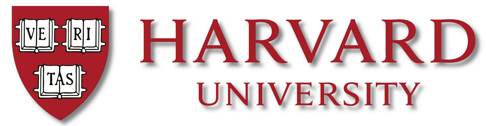
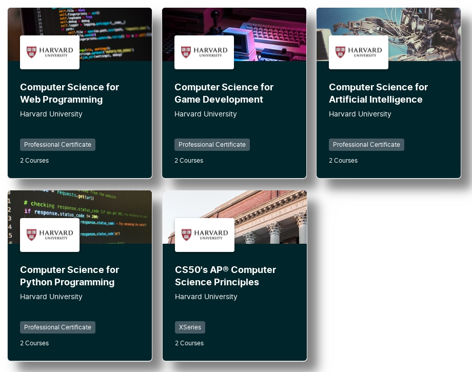

# This is CS50!

## Index

- [Setting the Stage: An Exploration of CS50](#setting-the-stage---an-exploration-of-cs50)

- [Scratching the Surface: Game Programming with CS50S ](#scratching-the-surface---game-programming-with-cs50s)

## Setting the Stage - An Exploration of CS50

Computer Science 50 is a foundational course offered by Harvard University. It's accessible both on-campus and online through various professional certificate programs, covering diverse areas such as AI, Mobile App and Game Development, Business Technologies, and Programming Principles.

##### Source : https://www.edx.org/cs50

All of the Certificate Programs include **CS50X:** *Harvard University’s introduction to the intellectual enterprises of computer science and the art of programming*. This course stands as the cornerstone - encompassing essential subjects like computational thinking, data structures, algorithms, and broader aspects of computer science. *Week 1* kicks off the course with **C**, but before that is *Week 0* - which explores **Scratch**, a high-level visual programming language.

Within the broader scope of the programme exists **CS50S:** *An introduction to programming using Scratch* - which is a comprehensive standalone course solely centered around Scratch. My strategy entails beginning with **CS50S** before embarking on the main course. This approach aims to establish a solid programming foundation within a more approachable environment, where I am to develop a robust grasp of programming principles before delving into a more intricate language such as **C**.

## Scratching the Surface - Game Programming with CS50S
